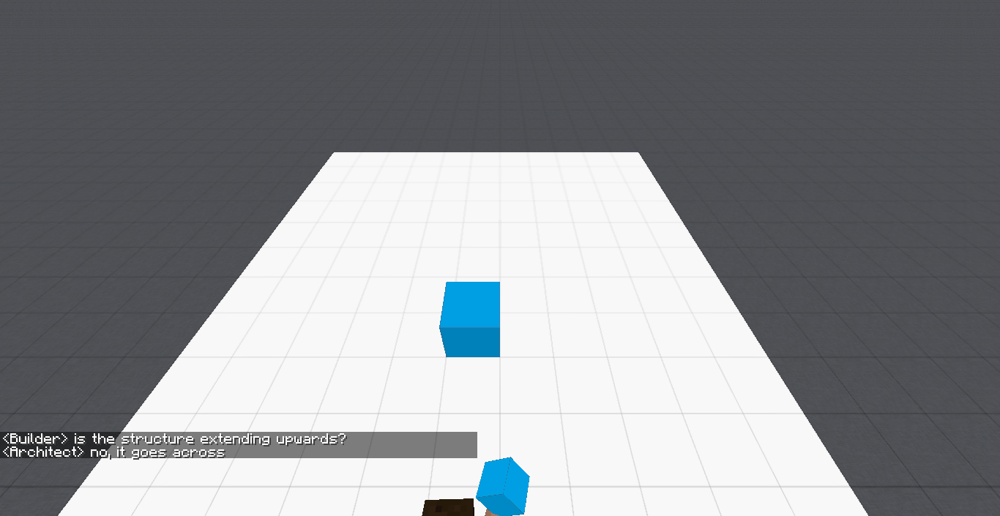
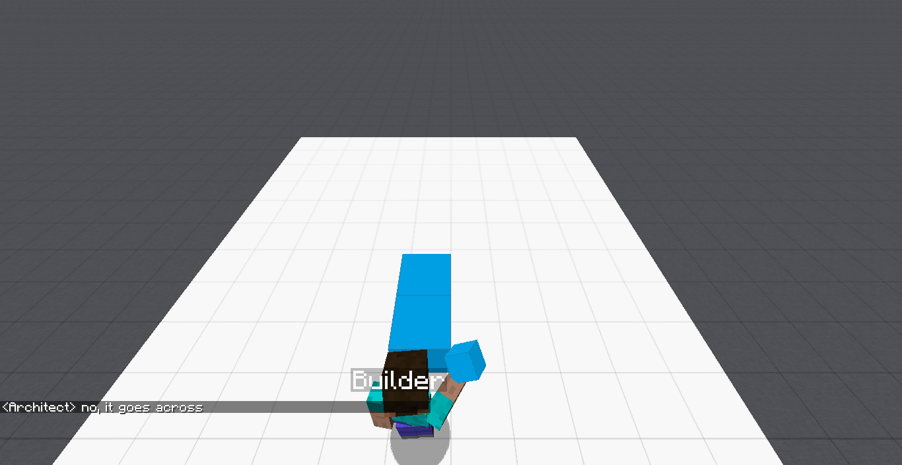
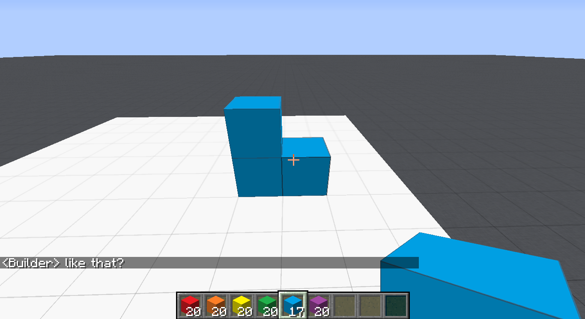

`<Builder>` Mission has started. 
`<Architect>` hello 
`<Builder>` hello 
`<Architect>` are u rdy to get to work? 
`<Builder>` yes 
`<Architect>` ok 
`<Architect>` build a 2x1 structure that is blue 
`<Builder>` is the structure extending upwards? 
`<Architect>` no, it goes across 
 
 
`<Builder>` is that good? 
`<Architect>` now place 1 blue piece on the left block extending upwards 
`<Architect>` yes that is correct 
 
`<Builder>` like that? 
`<Architect>` yes, now it is finished 
`<Builder>` good job! 
`<Architect>` you too builder 

